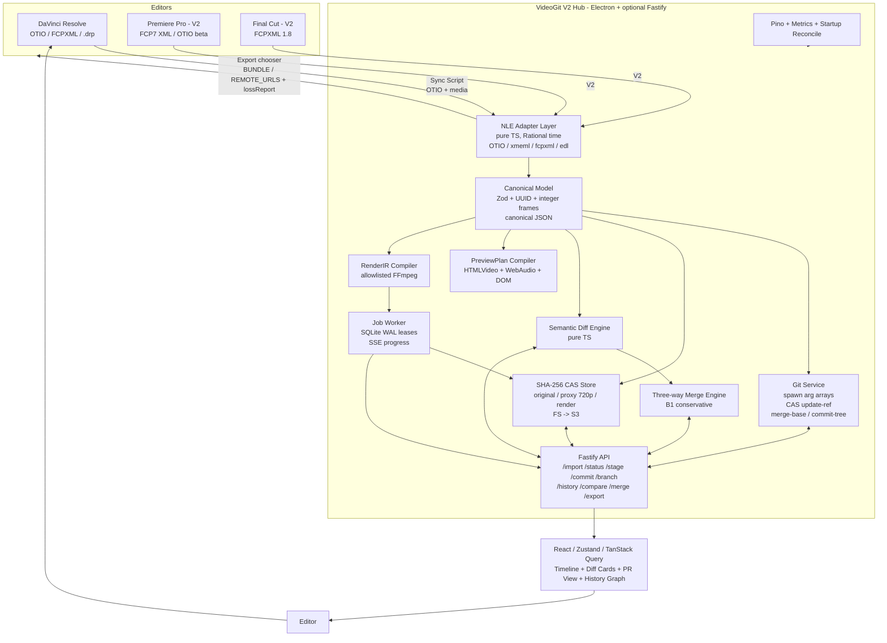

# VideoGit — End-to-End Robust System Architecture
## V1: GitHub for DaVinci (Single-Platform Version Control) → V2: Cross-Platform Universal Hub

> **Status:** V1-to-V2 roadmap. `VideoGit_Engineering_Plan.md` is the authoritative V1 implementation plan and wins if the documents conflict.
> **V1:** focused local DaVinci timeline version control. **V2:** companion HTTP API, media services, cross-NLE exchange, and hosted collaboration.

---

## 0. Decision Summary (Read First)

### Platform Verdict: **Standalone Desktop Hybrid — NOT a Chrome Extension, NOT a DaVinci-only Plugin**

**Choice:** **Electron desktop app (React/Vite renderer + typed preload IPC + Node main process).** A Fastify adapter and DaVinci companion script are optional V2 integrations over the same application services.

*   **Why not Chrome Extension?** No file system, cannot spawn `Git`/`FFmpeg`/`ffprobe` with arg arrays `Guide:201`, cannot handle GB media, no DaVinci API access, sandbox kills SSE + SQLite + CAS. Rejected outright. Useful only for future "comment overlay" — not for V1.
*   **Why not plugin-only (Resolve Panel / Fusion Script / Workflow Integration)?**
    *   Resolve Python API is limited and version-coupled (clip placement, track mutation unreliable pre-19, no marketplace, Studio-only).
    *   Plugin cannot own Git repo, SQLite WAL, or FFmpeg sandbox safely; debugging is painful; locks you to Blackmagic release cycle.
    *   Engineering Plan explicitly chose **C1 Standalone React/Vite** over **C2 NLE panel** for NLE-agnostic & portable `Engineering Plan axes C`. V2 would require rewriting for Premiere.
    *   Hybrid avoids the trap: core stays portable, DaVinci sync is a thin companion.
*   **Why Electron wins:**
    *   The sandboxed React renderer stays portable while Electron main owns Node filesystem, crypto, Git subprocesses, file dialogs, and atomic writes.
    *   Local V1 imports and exports OTIO through file dialogs. A later companion script can call an optional localhost adapter without changing domain or application services.
    *   Installer friction < plugin review friction. Auto-update via Electron updater. V2: add `adapters/premiere` without new plugin.

**Delivery:**
*   **V1 local:** `VideoGit.app` uses typed IPC and native Git. Footage remains external; the app stores canonical timeline snapshots and exports OTIO.
*   **V2 local integration:** optional Fastify localhost adapter plus `videogit_sync.py`.
*   **V2 hosted:** backend container, Postgres operational state, object storage, workers, and authentication.

### Tech Stack (Final)

| Layer | Choice | Why (ties to Guide) |
|---|---|---|
| **App shell** | **Electron 30 + Vite + React 18 + TypeScript 5 strict** | Guide: `React, Vite, TypeScript` for fast typed timeline `Guide:029`. Electron gives file system + spawn without browser sandbox. |
| **Client state** | **Zustand for V1; TanStack Query with the V2 HTTP adapter** | V1 state follows IPC commands; V2 query state handles jobs and SSE-backed resources. |
| **Styling** | Tailwind + shadcn/ui | Timeline scrubber, diff cards, conflict resolver need dense UI primitives. |
| **Local API** | **Typed Electron preload + IPC** | Keeps Node capabilities out of the renderer without adding a localhost server. |
| **Validation** | **Zod 3 (single source)** | Guide: same schemas for commands, tracked state, merge, render `Guide:038`. |
| **Version control** | **Native Git CLI via `child_process.spawn` arg arrays, shell disabled** | Guide: real commits/branches/tags/refs/index/merge-base/two-parent `Guide:041`. Atomic `update-ref <ref> <new-oid> <expected-old-oid>` for CAS. |
| **External API (V2)** | **Fastify localhost/hosted adapter** | Needed only by a companion script, CLI, or remote client. |
| **Media/render (V2)** | **SHA-256 CAS + pinned FFmpeg/ffprobe** | Added when in-app proxy, preview, or render is in scope. |
| **Operational storage (V2)** | **SQLite WAL → Postgres** | Jobs and merge sessions only; Git remains timeline history. |
| **Queue/realtime (V2)** | **Worker leases + SSE** | Added with media processing or hosted clients. |
| **Logging** | **Pino + correlation IDs** | Guide: `Guide:210` — project/commit/job/Git cmd/FFmpeg exit without leaking paths. |
| **Testing** | **Vitest + fast-check + Playwright** | Guide: `Guide:056` — property-based diff/merge + browser E2E. |
| **Auth (V2 hosted)** | **OIDC + short-lived access tokens** | Not required for the single-user IPC-only V1. |
| **Packaging** | Electron Forge | Package the IPC-based desktop app; add a pinned FFmpeg build only with V2 rendering. |

> **Rule:** Zod schemas, canonical serialization, native Git ancestry, and pure semantic diff/merge are the stable core. V2 services must wrap this core rather than replace it.

---

## 1. Goals & Non-Goals

### V1: Core Git workflow for DaVinci
**Goal:** Prove that Resolve OTIO timelines can be imported, semantically diffed, staged, committed, branched, checked out, merged, conflict-resolved, and exported accurately. V1 does not attempt every GitHub product feature.

**Roadmap feature map:** Core commit/branch/status/stage/history/checkout/merge capabilities are V1. Review, remotes, protected branches, render jobs, issues, notifications, and hosted permissions are V2.

| GitHub concept | VideoGit roadmap mapping | Guide anchor |
|---|---|---|
| Repository | DaVinci Project (≈ one timeline + asset set) | `Guide:069-075` canonical JSON |
| Clone / Fork | `Import DaVinci export (OTIO/FCPXML) → canonical → Git repo` | `Guide:061-068` ingest |
| Commit | Validated staged edits only; author/UTC/message in Git metadata | `Guide:105-109` |
| Branch | Native `refs/heads/<cut-name>` via Git | `Guide:110-114` |
| Status / Diff | Semantic diff: `Clip intro trimmed by 30 frames` not JSON line | `Guide:093-097` |
| Stage (hunk) | Atomic field groups; stale hunk blocked via hunk ID | `Guide:098-104` |
| Pull Request | **Merge Request**: base/ours/theirs + provision + resolver | `Guide:125-166` expanded below |
| Code Review | Compare view: two synced preview players + change cards with frame seek | `Guide:120-124` |
| Conflict Resolution | Base/ours/theirs/manual + drag reorder, validation-gated completion | `Guide:159-166` |
| History / Graph | Commit DAG with parents, branches, tags visualized | `Guide:115-119` |
| Blame / History of a clip | Clip UUID lineage (future: `git log --follow`) | implied by stable IDs `Guide:071` |
| Tag / Release | Immutable `git tag` for approved cut | `Guide:115` |
| Checkout | Branch switch with dirty-worktree guard (commit/discard/cancel) | `Guide:110-114` |
| Push / Pull (local) | `update-ref` CAS; hosted will add remote | `Guide:107` |
| Protected branch | Hosted V2: require PR, block direct commit | *new* |
| Actions / CI | Render job: `RenderIR → FFmpeg → probe+decode → atomic publish` | `Guide:176-183` |
| Issues | Deferred to V2 (post house review) — not in V1 | `Guide:226` |
| Notifications | SSE progress + Pino + metrics | `Guide:184-188` |

**Non-goals V1:** Media copying, proxy generation, MP4 rendering, companion HTTP API, SQLite jobs, cross-NLE adapters, hosted collaboration, multicam, keyframed effects, nested sequences, live cursors, cloud transfer, permissions, and full OTIO fidelity. V1 supports the cut-only Resolve OTIO subset defined by the Engineering Plan.

### V2: Cross-Platform Universal Hub
**Goal:** Same repo, now with **NLE adapters** (`OTIO` hub + `FCP7 XML` for Premiere + `FCPXML` for Final Cut + optional `AAF/EDL` fallback). Edit in Premiere, merge from Resolve/DaVinci, honest fidelity. Add: relink resolver, hosted infra, protected branches, team roles.

---

## 2. System Overview

The following diagram is the **V2 target architecture**. Local V1 contains only the Resolve OTIO adapter, canonical model, Git service, semantic diff/merge, Electron IPC boundary, and React UI.



**Core invariant `Guide:017-018`:** `Git stores edit decisions; media store keeps large files; VideoGit supplies timeline-aware status/diff/staging/merge/preview/export. One validated model powers all.` If this drifts, system is broken.

---

## 3. Detailed Component Architecture

### 3.1 Domain Model (`packages/types`) — Freeze First `Guide:214` `Engineering Plan Slice 1`

```
Project { id, name, createdAt, sequences: Sequence[] }
Sequence { id: UUID, fps: Rational{num,den}, width, height, tracks: Track[] }
Track { id, kind: "video"|"audio"|"caption", clipIds: UUID[] ordered }
Clip { id: UUID, assetId: SHA256, srcRange: [in,out) frames atomic, trackId, trim atomic group, gain: number bounded [-60,12], preset: enum allowlisted }
Caption { id: UUID, text: NFC string, range: [s,e) atomic inside sequence, style: enum }
AssetDescriptor { sha256, originalSha, proxySha?, durationFrames, width, height, fps, codecs: {video,audio}, createdAt }
AdapterAnnotation { clipId, field, sourceFormat, fidelity: L0|L1|L2|L3, dropped: boolean, reason } // V2
```

**Rules `Guide:071-075`:**
*   Every editable entity permanent UUID.
*   Time = integer frames, half-open ranges `120→240` includes 120, stops before 240.
*   Zod validates before write; NFC normalize, strip UI-only fields, sort keys, canonical UTF-8 JSON serialize. Same timeline → same state (prove with property test).
*   Local paths / floating timestamps / selection never in versioned JSON. Media SHA ≠ Git object ID `Guide:074-075`.

### 3.2 Git Service (`packages/git-service`) — The Hard Part `Guide:215`

*   **Primitives:** `spawn("git", ["commit-tree", ...], {shell:false})` everywhere `Guide:201`. `hash-object`, `update-index --cacheinfo`, `write-tree`, `commit-tree`, `update-ref <ref> <new-oid> <expected-old-oid>`, `merge-base`, `rev-parse`, `for-each-ref`, `log --graph --parents`.
*   **Stored state:** each Git commit contains a complete canonical `timeline.json` snapshot. Semantic diffs are derived by comparing snapshots; Git must never text-merge this file.
*   **Runtime state:** VideoGit maintains validated canonical `HEAD`, `INDEX`, and `WORKING` snapshots. `diff(HEAD, INDEX)` is staged and `diff(INDEX, WORKING)` is unstaged. Semantic staging applies an atomic hunk to the complete `INDEX` snapshot.
*   **Repo layout per project:** `<data>/repos/<projectId>/.git/` plus application-owned working state. The semantic `INDEX` is stored as a complete canonical `timeline.json` blob in Git's real `.git/index`, updated programmatically with `hash-object` and `update-index --cacheinfo`.
*   **Mutex:** per-project async `Mutex` + CAS `update-ref`. A mutation that loses the expected-HEAD race returns a stale-state error.
*   **Atomicity:** `validate INDEX → serialize canonical timeline → write Git tree → create commit (parent = HEAD) → CAS update-ref`. Never move a branch on an invalid snapshot.
*   **Merge:** `resolve heads → find merge-base → load base/ours/theirs → pure TS merge → validate provisional → either create tree+2-parent commit or open resolver session in SQLite` `Guide:127-129`.

### 3.3 Media Store (V2) (`packages/media-store`) — `Guide:061-068` `Guide:216`

```
CAS layout: <data>/cas/sha256/<aa>/<bb>/<sha256>.ext  (original immutable)
proxies:     <data>/cas/sha256/<aa>/<bb>/<sha256>.proxy.mp4 (CFR 720p30 H.264 yuv420p + AAC 48k `Guide:022`)
renders:     <data>/renders/<commitSha>-<profile>-<rendererVer>.mp4 (cache key = commit+profile+assetHashes `Guide:186`)
```

*   **Ingest pipeline V2:** `Resolve export + media folder → stream and hash → ffprobe → CAS → verified proxy → AssetDescriptor`. Deduplicate before transcoding. V1 stores media references and does not copy footage.
*   **V2 ingest:** Same pipeline, adapters normalize to canonical first, then CAS.

### 3.4 Semantic Diff & Hunks (`packages/diff`) — `Guide:093-104` `Guide:123`

*   Pure TS, no Git. Load 3 states: `HEAD`, `index (reconstructed)`, `working`. `diff(HEAD,index)=staged`, `diff(index,working)=unstaged` `Guide:097`.
*   Join entities by stable ID, compare schema fields, emit hunks: `{entityId, fieldGroup atomic, before, after, template: "Clip {name} trimmed by {n} frames", affectedFrameRange}`.
*   **Atomic groups:** `trim in+out`, `clip addition + track order`, `caption range start+end` move together `Guide:100-101`. Hunk ID = `hash(indexTree + before + after)` so old browser cannot stage wrong edit `Guide:103`.

### 3.5 Three-Way Merge (`packages/merge`) — `Guide:125-166`

**Conservative B1 rules `Guide:132-158` (trustworthy, testable, out-positions Vit AI):**

| Situation | Result | Reason |
|---|---|---|
| Only one side changed field | Take changed | Other matches base |
| Both same change | Keep shared | No disagreement |
| Different fields | Combine, then validate | Independent unless invalid together |
| Same field differently | **Conflict** | Editorial intent ambiguous |
| Delete vs unchanged | Delete | Only one side changed |
| Delete vs modify | **Conflict** | System cannot know |
| Both changed clip order differently | **Conflict** | Must not invent order |
| Combined fails whole validation | **Conflict** | Independent edits → invalid timeline |

*   Validate full provisional timeline after field merges — individually safe ≠ jointly safe.
*   **Resolver:** stores `{entity, field, type, base, ours, theirs, validationErrors}`. UI offers base/ours/theirs/manual; each choice updates and revalidates the provisional timeline. V1 persists this state atomically in application storage; V2 may move it to SQLite. Completion is blocked until the timeline is valid, abort leaves the target unchanged, and a moved target ref forces recomputation.

### 3.6 Command / Reducer Layer (`packages/commands`)

*   React pointer → frame-snap → typed `EditCommand` (`TrimClip`, `ReorderClips`, `UpdateCaption`, `SetGain`, `SetPreset`) → reducer → full timeline validation → canonical save → version bump for workspace guard `Guide:078,085,089`.
*   Zod validates commands + project before save. Rejects overlapping placements, source beyond asset duration, caption outside sequence `Guide:078,083`.

### 3.7 Preview & Export — Two Outputs, Same Model `Guide:168-183`

*   **Preview `Guide:169-175`:** Resolve working state or commit (resolve to immutable `commitId`) → validate → compile `PreviewPlan {segments: [{assetSha, srcRange, gain, preset, captions}]}` → browser plays normalized proxies with `HTMLVideoElement`, schedules segment switch from `media time`, `WebAudio GainNode`, `DOM overlay` for captions. Editorial approximation; final MP4 is delivery truth. Missing proxy blocks preview not history `Guide:175`.
*   **Export `Guide:176-183`:** Resolve commit → validate → confirm all media exists → `RenderIR` (typed IR) → allowlisted FFmpeg filter graph → `spawn` arg array, shell disabled → temp file → `ffprobe` + decode check (duration/streams) → atomic move to render store only if passes `Guide:180`. Pinned FFmpeg build `Guide:181`, profile `H.264 yuv420p + AAC` v1 `Guide:182`. Never publish partial even if FFmpeg exits 0 `Guide:183`.
*   **CI-like render jobs `Guide:184-188`:** durable `jobs` row before spawn, worker claims via lease, streams FFmpeg progress to SSE, cancel = graceful SIGTERM → escalate after timeout, retry = new attempt, cache hit on (commit+profile+hashes+rendererVer).

### 3.8 Adapter Layer (V2 delta) — Cross-Platform Hub

Portable hub: every NLE has `import(adapterFormat) → canonical` and `export(canonical → adapterFormat)`.

| Adapter | In | Out | Fidelity | Notes 2026 |
|---|---|---|---|---|
| `otio` | ✅ | ✅ | L0-L1 best | Native Resolve, Premiere 25.6 beta, FCP via FCPXML→OTIO |
| `xmeml` (FCP7 XML v5) | ✅ | ✅ | L0-L1 | Premiere + Resolve |
| `fcpxml` 1.8 | ✅ | ✅ | L0-L1 | Final Cut; asset-clip spine |
| `edl` CMX3600 | ✅ | ❌ (fallback) | L0 only, 1 track | Human-readable fallback [CutConvert] |
| `aaf` | V2.1 | V2.1 | L1 + audio levels | Avid/ProTools; binary, defer for cost |

*   All time via `Rational` + `secondsToFrameAligned` snapping (matches `ChatOctopus/timeline` need).
*   Export `lossReport.json` per asset/field: `{field, L-trier, dropped, reason, alternative}`. UI shows fidelity badge.

---

## 4. DaVinci Integration — V1 Files, V2 Companion

### Why DaVinci first (not Premiere)
*   OTIO native since 18+ (import+export) — one adapter covers V1.
*   Resolve API script story simpler than Premiere CEP.
*   Color pipeline complexity actually favors starting with Resolve: if hub normalizes to CFR proxy, color decisions can stay as `preset enum` rather than attempting to port Color page nodes (explicitly excluded `Guide:222-224`).

### Optional V2 integration architecture (no heavy plugin)

```
[Resolve] -- File > Export > OTIO (or FCPXML) --> ~/VideoGit/inbox/<project>/*.otio + media/
       ↕ Companion Script (videogit_sync.py)
   [VideoGit Hub API]  <--- HTTP localhost ---+
       ↕ File Watch (chokidar)
   [VideoGit UI — shows DaVinci project + status]
```

**Optional V2 companion script `tools/resolve_sync.py`:**
```python
# Workspace > Scripts > Comp > VideoGit Sync
# 1. getMediaPool().GetCurrentTimeline().Export(path, "otio") — fallback to fcpxml
# 2. collect media via GetMediaPoolItem().GetClipProperty("File Path")
# 3. POST multipart to /api/projects/:id/ingest {otio, media[]}
# 4. poll /api/jobs/:id via SSE
# Export side: GET /api/projects/:id/export?format=otio&commit=HEAD → download .otio → Fusion Scripts Comp > Import
```

**V2 companion workflow:**
1.  Create project in Hub → `videogit_sync.py: Export from Resolve` → Hub ingests OTIO → hashes media → proxy → `working project` = committed `HEAD` initially.
2.  Edit in Resolve (trim/reorder/captions/gain/preset) → Sync → Hub sees `working` vs `index` vs `HEAD` diff → semantic status `Guide:093`.
3.  Stage selected hunks in Hub UI, commit with message, branch `feature-grade`, compare two commits with two synced proxy players `Guide:120`.
4.  Merge Request: choose target/source → Hub finds `merge-base` → auto-merge or conflict resolver → 2-parent commit `Guide:163-164`.
5.  Tag `v1.0` via Hub → `Sync back to Resolve`: Hub exports OTIO for chosen commit + `BUNDLE` zip (otio + media links) → Resolve imports, re-links via SHA folder.

**Missed intermediary step fixed:** Without this script, users would manually export OTIO + zip media; script makes it one click and preserves atomic hunk mapping.

---

## 5. V2 HTTP and Media Flows

These flows describe the optional Fastify/media layer. Local V1 invokes equivalent timeline application services through Electron IPC and does not upload or proxy media.

### 5.1 Import DaVinci Project Through the V2 Adapter

```
User: Resolve > VideoGit Sync
  → frontend: POST /api/projects (name) → BE: create empty Git repo (git init --bare? no — normal repo with work tree)
  → script: POST /api/projects/:id/ingest/otio (multipart)
  → BE: [1. generate job row in SQLite (status=queued)]  << missed: durable job before spawn `Guide:186`
      [2. stream+hash+ffprobe → CAS `Guide:063-064`]
      [3. validate OTIO → canonical via Zod + Rational snaps]
      [4. dedup check `Guide:066`]
      [5. FFmpeg proxy per unique SHA → verify `Guide:065`]
      [6. canonical JSON write (NFC, sorted keys) → validate relationships `Guide:071-073`]
      [7. git add + `write-tree` + `commit-tree` with HEAD parent (`compare-and-swap` `Guide:107`)]
      [8. mark job done, SSE -> UI]
      [9. startup reconcile not needed yet but lease exists `Guide:192`]
  → UI: TanStack Query invalidates history, shows HEAD, preview compiles `PreviewPlan` `Guide:173`
```

### 5.2 Edit → Status → Stage → Commit → Branch → Checkout (the GitHub inner loop)

```
Resolve edit + Sync
  → working project mutated via command reducer `Guide:078`
  → BE recomputes: load HEAD/index/working, validate all three, diff via semantic engine `Guide:097`
  → UI: two groups Staged (HEAD↔index) vs Unstaged (index↔working) human summaries `Guide:095`
  → User selects hunks → POST /api/stage {hunkIds, expectedIndexTree} 
    → BE: verify not stale `Guide:103`, apply to temp index model, validate whole project, write blobs, atomically update index `Guide:102`  << missed: hunk atomic grouping + stale guard
    → working remains untouched `Guide:104` (so experiments stay unstaged)
  → User POST /api/commit {message, expectedHead} 
    → BE: reconstruct from index, reject empty/invalid, write-tree, commit-tree, CAS update-ref `Guide:109` << missed: author UTC in Git meta not entity noise
  → User POST /api/branches {name} → BE: `git branch` validation, create ref at HEAD
  → User POST /api/checkout {branch}
    → BE: if staged/unstaged exists → refuse, require commit/discard/cancel `Guide:112`  << missed: dirty guard
    → serialize with project mutex `Guide:112`, update index+working + validate `Guide:114`
```

### 5.3 Compare → Merge Request → Resolve → Tag

```
User opens Compare: GET /api/compare?base=main&head=feature 
  → BE: load validate both canonical states, join by stable ID, emit hunks + affected frame range per hunk `Guide:122`, sort
  → UI: change cards + timeline markers, click seeks both players `Guide:121` << missed: frame range attach
User Create Merge Request: POST /api/merge {target=main, source=feature}
  → BE: resolve heads, find `git merge-base`, fast-forward if possible else load base/ours/theirs `Guide:127`  << missed: fast-forward check
  → pure TS 3-way per B1 rules `Guide:132-158` → validate provisional → 
    if clean: write tree + 2-parent commit (target first parent) `Guide:164` + CAS update-ref, return success
    else: create SQLite mergeSession {conflicts: [{entity,field,type,base,ours,theirs,validationErrors}]} `Guide:161`, return sessionId, open resolver UI
Resolver loop `Guide:161-163`: POST /api/merge/:id/resolve {choice: base|ours|theirs|manual (+ drag reorder for ordering conflicts)}
  → BE: update provisional, re-validate, repeat until clear; disable Complete until valid `Guide:161`
  → POST /api/merge/:id/complete → write tree + 2-parent commit + CAS update-ref; if target moved → 409 recompute `Guide:166`; Abort → delete session, branch unchanged `Guide:165`
Tag release `Guide:115`: POST /api/tags {name, commitId, message} → `git tag -a` immutable by default.
```

### 5.4 V2 Preview, Render, and DaVinci Back-Sync

```
Preview `Guide:169-175`: GET /api/preview?revision=HEAD|commitId|working 
  → resolve to commitId before work `Guide:115` (so moving branch not affect) → validate → compile PreviewPlan → fetch proxy ranges → play segments via HTMLVideoElement + WebAudio Gain + DOM captions `Guide:173`

Export committed revision `Guide:176-183`:
  → POST /api/renders {commitId, profile="720p30"} → BE: resolve commit, validate, confirm all media in CAS, compile RenderIR → allowlisted FFmpeg arg array (shell disabled) → temp file → ffprobe + decode-check (streams/duration) → atomic publish only if pass → notify SSE
  → Companion back-export: GET /api/export?commitId&format=otio → compile OTIO from canonical + `lossReport` → download .otio (+ BUNDLE zip if requested) → Resolve imports

Job progress `Guide:184-188`: POST creates job row before spawn → worker claims a SQLite WAL lease using `BEGIN IMMEDIATE` plus a conditional `UPDATE ... RETURNING` → spawn FFmpeg reading progress `stderr` → SSE to UI → Cancel = mark canceled + SIGTERM, escalate after timeout `Guide:186` → Retry = new attempt linked to request → Cache hit on key

Missed robust points added: **idempotency key** on all `/stage /commit /merge/complete /renders` (retry safe), **SSE reconnect with Last-Event-ID**, **job expiry + temp cleanup** `Guide:192`.
```

---

## 6. Optional V2 HTTP API Surface

This is an adapter over application services, not the local V1 boundary. The authoritative V1 boundary is typed preload IPC.

```
# Projects & Media
POST   /api/projects                     {name} -> {projectId}
POST   /api/projects/:id/ingest/otio    multipart otio+xml + media[] -> {jobId}
GET    /api/projects/:id/status         -> {staged: Hunk[], unstaged: Hunk[], head, indexTree}
POST   /api/projects/:id/stage          {hunkIds[], expectedIndexTree, idempotencyKey} -> {newIndexTree}
POST   /api/projects/:id/unstage        ...
POST   /api/projects/:id/commit         {message, author, expectedHead, idempotencyKey} -> {commitId}
GET    /api/projects/:id/history        ?limit&beforeCommit -> {commits: {id,message,author,time,parents[], branchLabels, tagLabels, summaryVsParent}[]}
GET    /api/projects/:id/commits/:sha   -> canonical JSON

# Branches / Checkout / Tags
POST   /api/projects/:id/branches       {name, fromCommit?}
GET    /api/projects/:id/branches       -> {branches: {name, commitId}[]}
POST   /api/projects/:id/checkout       {branch, strategy: "requireClean"|"forceDiscard"} // refuses dirty unless forceDiscard with confirm `Guide:112`
POST   /api/projects/:id/tags           {name, commitId, message}

# Compare / Merge (PR)
GET    /api/projects/:id/compare        ?base&head -> {hunks: Hunk[] with affectedFrameRange}
POST   /api/projects/:id/merge          {target, source, idempotencyKey} -> {status:"fastForwarded"|"merged"|"conflicts", sessionId?, conflicts?}
GET    /api/projects/:id/merge/:sid     -> session + provisional
POST   /api/projects/:id/merge/:sid/resolve {conflictId, choice: "base"|"ours"|"theirs"|"manual", value?}
POST   /api/projects/:id/merge/:sid/complete {idempotencyKey}
POST   /api/projects/:id/merge/:sid/abort

# Preview / Export / Render
GET    /api/projects/:id/preview        ?revision=working|HEAD|commitId
POST   /api/projects/:id/renders        {commitId, profile, idempotencyKey} -> {jobId}
GET    /api/jobs/:id                    -> {status, progress, error, resultPath?}
GET    /api/jobs/:id/events             SSE progress
POST   /api/jobs/:id/cancel
POST   /api/jobs/:id/retry

# DaVinci Sync & V2 Adapters (new)
POST   /api/projects/:id/ingest         ?format=otio|xmeml|fcpxml|edl  // V2 unified
GET    /api/projects/:id/export         ?commitId&format=otio|xmeml|fcpxml|edl&delivery=bundle|remoteUrls -> .otio/.xml + lossReport.json (+ zip if bundle)
GET    /api/projects/:id/lossReport     ?commitId&targetFormat -> {items: AdapterAnnotation[]}

# Ops (Guide:195-204)
POST   /api/admin/reset-demo            {projectId, scope: "demoOnly"} // explicit scoped `Guide:197`
GET    /api/health                      -> {gitOk, casOk, dbOk, ffmpegVersion}
```

**Common guarantees:** All writes return `409 Stale` if CAS `expected*` mismatches; all require `Authorization` when hosted; correlate via `X-Request-Id` → Pino `Guide:210`.

---

## 7. V2 Operational Data Model (SQLite WAL → Postgres)

```sql
-- projects
CREATE TABLE projects (id TEXT PRIMARY KEY, name TEXT, repoPath TEXT UNIQUE, createdAt TEXT);

-- jobs — durable, lease-based `Guide:186-188`
CREATE TABLE jobs (
  id TEXT PRIMARY KEY, projectId TEXT, type TEXT CHECK(type IN ('ingest','proxy','render','translate')),
  commitId TEXT, profile TEXT, inputSha TEXT,
  status TEXT CHECK(status IN ('queued','claimed','running','succeeded','failed','canceled')),
  leaseUntil TEXT, workerId TEXT, attempt INTEGER, progress REAL,
  resultPath TEXT, error TEXT, createdAt TEXT, updatedAt TEXT
);
CREATE INDEX idx_jobs_lease ON jobs(status, leaseUntil);

-- merge sessions — temp, branch unchanged until complete `Guide:162-165`
CREATE TABLE merge_sessions (
  id TEXT PRIMARY KEY, projectId TEXT, target TEXT, source TEXT, base TEXT,
  provisional TEXT /*canonical JSON*/, conflicts TEXT /*JSON array*/, status TEXT, createdAt TEXT
);

-- cache — disposable `Guide:058`
CREATE TABLE render_cache (key TEXT PRIMARY KEY, path TEXT, createdAt TEXT); -- key = sha256(commit+profile+assetHashes+rendererVer)

-- V2 advisory (not for history) `Guide:058`
CREATE TABLE translation_cache (srcSha TEXT, targetFormat TEXT, resultSha TEXT, lossReport TEXT, PRIMARY KEY(srcSha,targetFormat));
```

**Git is source of truth for timeline; SQLite only for mutable operational data** `Guide:058` — cache can be wiped and rebuilt from Git+CAS.

---

## 8. Robustness Layer — The Intermediary Points You Missed

### 8.1 Auth & Permissions (GitHub-like, not in Guide — required for robustness)

*   **Local:** OS keychain token, single user (`Guide` single-node first release).
*   **Hosted:** OIDC (Google/GitHub SSO), JWT 15m + httpOnly refresh rotation, org → project → role (`viewer` can compare/preview, `editor` can stage/commit/branch, `maintainer` can merge/tag/protect). Branch protection rule: `main` requires PR with at least 1 approval + no conflicts + valid provisional `Guide:161`.

### 8.2 Safety & Security `Guide:200-204`

*   `spawn` with **arg arrays, shell disabled** for Git/ffprobe/FFmpeg.
*   Generated internal paths only; reject URL/protocol indirection; allow only local uploaded objects `Guide:201`.
*   FFmpeg run with CPU/mem/output-size/wall-clock limits in isolated worker (Docker `runtime --pids-limit --memory`).
*   Zod input validation everywhere; project mutex for checkout/stage/commit/merge-complete; CAS `update-ref`.
*   Preset/gain are **enum/bounded**, never raw FFmpeg text → compiled to allowlisted filter graph `Guide:088`.

### 8.3 Recovery `Guide:190-194`

*   **Startup reconcile:** inspect `.git/` for lock files, `git fsck`, reconcile `jobs` leases (expired `queued`), `merge_sessions` left `running`, return leases to queue, quarantine temporary renders by expiry, remove temp ingest files `Guide:192`.
*   Repo mutations short & atomic; SQLite TX.

### 8.4 Demo/Test Reset `Guide:195-199`

*   Keep small verified seed repo + media objects (`tests/fixtures/` like `ChatOctopus`).
*   `POST /admin/reset-demo` restores seed Git state, clears only demo sessions/jobs, verifies proxies, checks out expected branch, smoke checks. Scoped, never deletes arbitrary project `Guide:197`.

### 8.5 Observability `Guide:210-211`

*   Every request/repo op/merge/job carries `correlationId`. Pino logs: `projectId, commitId, jobId, gitCommand, ffmpegExit, duration, errorCategory` — never full command or media path.
*   Metrics: job latency, failure rate, merge conflict rate, stale-ref rate, cache hit, recovery events. OTEL later when >1 node.

---

## 9. DaVinci vs Cross-Platform: What Changes in V2

| Dimension | V1 (DaVinci-only) | V2 (Universal Hub) delta |
|---|---|---|
| **Adapters** | `otio` (+ `fcpxml` fallback) | Add `xmeml v5` (Premiere), `fcpxml` full, `edl` fallback, `aaf` V2.1. Rational snap table shared. |
| **Ingest** | Resolve OTIO path only | `POST /ingest?format=` unified; auto-detect; dedupe across NLE origins via SHA. |
| **Export** | `GET /export?format=otio` for Resolve back-sync | `GET /export?format=&delivery=bundle|remoteUrls` + `lossReport.json` per export. |
| **Relink** | File watch + companion script | **Relink Resolver UI**: SHA primary → filename+timecode → manual resolver with side-by-side proxy preview. |
| **Merge** | Same NLE origins | **Cross-NLE origins**: `base` may be OTIO origin, `ours` from Premiere, `theirs` from Resolve — merge still on canonical model; conflict cards show `sourceNLE` badge. |
| **Storage** | Local CAS FS | CAS abstract → **S3/MinIO**; switch via env, no history rewrite `Guide:050`. |
| **Queue** | In-process worker, one node | **BullMQ / SQS** + container workers `Guide:246`. |
| **Permissions** | Single user | OIDC + org roles + branch protection + review approvals. |
| **Interchange** | No | **BUNDLE zip** (`doc + media`) pattern proven by `videogen.io` `docs.videogen.io`. |

**V2 is additive:** no canonical break. V1 commit history remains valid; V2 adapters re-compile same commits to different NLE formats.

---

## 10. Non-Functional & Deployment

### V1 Local (authoritative MVP)

```
[React renderer] -> [typed preload IPC] -> [Electron main/application services] -> [Git repositories + atomic app state]
```
*   No localhost server, media CAS, FFmpeg worker, SQLite job queue, or authentication in V1.

### Hosted Evolution (`Guide:246` — keep same Git/timeline semantics)

```
[CloudFront] -> [ALB] -> [ECS Fastify N] -> [RDS Postgres] + [ElastiCache]
                               |-> [SQS] -> [ECS FFmpeg Workers pool] -> [S3 CAS + renders]
                               |-> [EFS or S3 backend for Git repos] (or per-project bare clone)
```
*   Replace SQLite with Postgres operational state, local CAS with S3, in-proc queue with SQS — same Zod/Git/FFmpeg core.

### Missed intermediary infra points
*   **Pinned FFmpeg build** for repeatable behavior `Guide:181`; version stored in cache key `Guide:186`.
*   **Temp expiry cleanup** background task `Guide:192`.
*   **Offline verification**: full edit→stage→commit→branch→compare→merge→export demo succeeds repeatedly offline `Guide:244`.

---

## 11. Testing Strategy `Guide:205-209`

*   **Unit / property (Vitest + fast-check):** canonical serialization determinism + frame arithmetic + semantic diff + B1 merge (generate independent/conflicting pairs). Must include adapter round-trip `fixture.xml -> canonical -> export.otio -> canonical` equality on L0.
*   **Integration (temp repos):** real Git `init → commit → branch → merge-base → 2-parent`; DaVinci fixtures exported from Resolve (OTIO/FCPXML) swept like `ChatOctopus tests/fixtures`.
*   **Render:** small synthetic fixtures through FFmpeg; golden fixture assert `streams, duration, frame-hashes, audio presence` not byte equality `Guide:207`.
*   **Browser (Playwright):** from **reset seed `Guide:195-199`** → two complete journeys: clean merge (auto) and conflict-resolution (manual `base/ours/theirs/drag reorder`) → export probe pass.
*   **Negative:** malformed OTIO/XML/AAF, oversized media, concurrent CAS commit race, SIGKILL mid-render → recovery `Guide:192`.

---

## 12. Build Sequence — Vertical Slices

Do not polish editor before proving timeline can be committed+merged `Guide:212-213`.

| Slice | What you ship (end-to-end slice, not layer) | Proof (DoD) | Guide |
|---|---|---|---|
| **S0 Model freeze** | UUIDs, Rational frames half-open, canonical JSON + Zod, Gan<->B1 rules doc | Same logical timeline → same state (property test) | `Guide:214` |
| **S1 Git+merge headless** | Repo service, CAS `update-ref`, merge-base, 2-parent commit, no UI | Two branches independent/conflicting edits → merge or conflicts | `Guide:215` |
| **S2 Resolve OTIO round trip** | Minimal OTIO adapter, real Resolve fixtures, canonical import/export, structured unsupported-content report | Supported clips, gaps, tracks, and timing re-import within one frame | `Engineering Plan` |
| **S3 Edit+commit loop + dirty guard** | Typed commands → reducer → `HEAD`/`INDEX`/`WORKING` → semantic stage → Git commit → branch → checkout → history | Commit contains the complete staged snapshot only; checkout refuses dirty state | `Guide:217` |
| **S4 Compare + merge** | Semantic change cards + merge-base + conservative three-way merge + validation-gated resolver | Clean merge succeeds; conflicts cannot complete while invalid | `Guide:218` |
| **S5 OTIO checkout/export** | Resolve an immutable commit, validate it, serialize OTIO, and export through a file dialog | Export re-imports in Resolve with supported timing intact | `Engineering Plan` |
| **S6 V1 hardening** | Atomic state writes, expected-old ref updates, restart recovery, fixtures, property tests, Playwright flow | Full local workflow repeats offline without corrupting history | `Engineering Plan` |
| **S7 V2 media + companion** | Optional Fastify adapter, Resolve script, CAS, proxy/render worker, SQLite jobs, SSE | Media work survives cancel/restart and never enters Git | `Guide:216` |
| **S8 V2 adapters** | `xmeml` + `fcpxml` + `edl`, bundle delivery, relink resolver | Premiere→Hub→Resolve round trip preserves supported cuts within one frame | — |
| **S9 V2 hosted** | Object storage, Postgres, queue, OIDC, branch protection | Same canonical/Git history works behind hosted adapters | `Guide:246` |

**Missed step that would have broken you:** Without `hunk atomic grouping + stale guard + CAS + dirty checkout guard`, a user on DaVinci would silently overwrite the other editor's trim or lose experimental preset — now it's a 409.

---

## 13. Risks & Mitigations

| Risk | Likelihood | Mitigation (structural) |
|---|---|---|
| OTIO spec drifts (Premiere beta → release) | Medium | Pin adapter to OTIO 1.0 schema + fixture CI that pulls real Resolve/Premiere exports weekly; canonical absorbs break |
| User expects color/effects to survive cross-platform | High | Tier badge + `lossReport.json` + provider FAQ; do not claim V1 lossless |
| Resolve API breaks sync | Medium | Companion script is thin; fallback = manual OTIO file drop to watch folder |
| Media huge (4K RAW) → proxy OOM | Medium | Stream hash, probe before proxy, dedupe before transcode, worker limits `Guide:066,201` |
| Concurrent edits lose data | Medium | Per-project mutex + hunk stale + CAS `Guide:102,107` + workspace version `Guide:078` |
| FFmpeg hang | Medium | Wall-clock kill + escalate SIGKILL + lease expiry + temp expiry `Guide:186,192` |

---

## 14. Open Decisions to Lock Before Build

1.  **DaVinci companion sync direction (V2):** File watch auto-ingest vs explicit "Sync" button? (Recommend explicit sync plus an optional watch mode.)
2.  **Single local worker vs queue abstraction day-1?** `Guide` says single-node first, abstract boundary now (`Engineering Plan` open Q). **Decision: abstract `JobQueue` interface on day 1, implement `SqliteQueue`; V2 injects `SqsQueue` without rewrite.**
3.  **Preset enum allowlist scope (V2 render):** lock before implementing preview/render because it drives both CSS and the FFmpeg compiler.
4.  **Demo seed as Git bundle vs scripted fixture** `Engineering Plan` open Q — recommend **scripted fixture + checked fixtures in `tests/fixtures/`** (deterministic in CI, not binary bundle).
5.  **Checkout dirty strategy UX:** `commit / discard (explicit confirm) / cancel` — which is default? Recommend `commit` default to prevent data loss `Guide:112`.

---

## 15. Deliverables & Definition of Done (V1 — must pass before V2)

`Guide:228-244` + `Engineering Plan` DoD — release ready when *branch-and-merge story works repeatedly*, not when screens exist:

*   [ ] Commits/branches/refs/merge-bases/tags/2-parent merges are real Git objects, survive restart `Guide:230`.
*   [ ] Footage never enters Git; commits contain canonical timeline snapshots and stable media references only.
*   [ ] HEAD / index / working distinct; commit = only staged edits `Guide:232`.
*   [ ] Every edit has human semantic diff tied to stable clip/caption ID `Guide:233`.
*   [ ] Independent DaVinci edits auto-merge without loss `Guide:234`.
*   [ ] Same-field/delete-vs-modify/order/invalid timing → explicit conflicts `Guide:235`.
*   [ ] Merge cannot finish with conflicts or invalid provisional `Guide:236`.
*   [ ] Abort leaves target unchanged; stale client cannot overwrite moved branch `Guide:237`.
*   [ ] Checkout refuses to destroy uncommitted work without explicit choice `Guide:238`.
*   [ ] OTIO checkout/export resolves immutable commit IDs and passes Resolve round-trip fixtures.
*   [ ] Tests cover canonical serialization, OTIO, semantic diff/merge, Git history, and stale-ref protection.
*   [ ] Playwright passes clean-merge + conflict-resolution from reset seed `Guide:243`.
*   [ ] Full local loop: `import → diff → stage → commit → branch → compare → merge → resolve → export OTIO → re-import in Resolve` succeeds repeatedly offline.

---

## 16. What to Postpone (to keep V1 trustworthy) `Guide:222-227`

Live multi-user cursors, arbitrary FFmpeg filters/plugins, smart order auto-merge (B2), cloud asset transfer, org permissions, review approvals until local workflow reliable, full AAF/OTIO advanced interchange until internal model stabilized (V1 uses OTIO basic profile only).

---

## 17. File Map (create these)

```
/videogit/
  packages/
    types/           Zod schemas, Rational, canonical serializer, UUID
    git-service/     spawn wrappers, repo mutex, CAS, merge-base, two-parent commit
    media-store/     CAS FS->S3 abstract, ffprobe/FFmpeg proxy + verify
    diff/            pure semantic diff engine (3 states → hunks)
    merge/           pure 3-way B1 engine + conflict model
    commands/        EditCommand types + reducer + workspace version
    adapters/        otio/ xmeml/ fcpxml/ edl (V1: otio minimal, V2: full)
    api/             Fastify routes (status, stage, commit, branch, compare, merge, preview, render, ingest/export)
    worker/          SQLite/Postgres leases, FFmpeg spawn, SSE, cancel/retry, reconcile
    ui/              React timeline, diff cards, PR view, history graph, resolver, relink resolver (V2)
  tools/
    resolve_sync.py  DaVinci companion script
  tests/
    fixtures/        real OTIO/FCPXML exports from Resolve for regression
  app/
    electron/        main process, IPC, updater
  infra/             docker-compose (local), terraform/ecs (hosted V2)
```

---

**Next action:** Follow the authoritative Engineering Plan: scaffold Electron Forge with Vite/TypeScript, freeze the Zod canonical model, and prove the Resolve OTIO round trip before building the timeline UI. Add Fastify only with the V2 companion/API slice.
